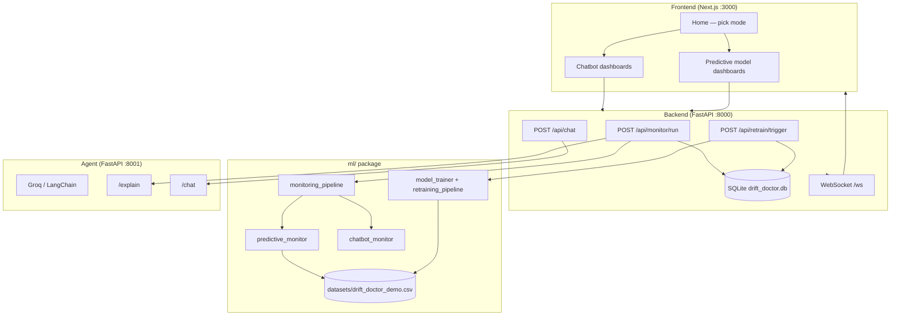

# Drift Doctor

**Drift Doctor** is an AI reliability platform for monitoring production ML and chatbot systems. It detects statistical and behavioral drift, explains findings with an LLM agent, and runs a train–validate–deploy retraining pipeline for intent classifiers.

Deployment project link: https://drift-doctor-frontend-latest.onrender.com

The stack is three Python services plus a Next.js dashboard:

| Service | Port | Role |
|---------|------|------|
| **Backend** (FastAPI) | `8000` | REST API, SQLite persistence, WebSocket fan-out, orchestrates ML + agent |
| **Agent** (FastAPI + Groq) | `8001` | Drift explanation, copilot chat, retrain recommendations |
| **Frontend** (Next.js) | `3000` | Dashboard for chatbot vs predictive model modes |

---

## Architecture



### End-to-end flow (predictive demo)

1. User opens **Predictive model** in the UI and runs **Monitor**.
2. Backend calls `ml.monitoring_pipeline.run_monitoring` with `system_type: "predictive_model"`.
3. ML loads production rows from `datasets/drift_doctor_demo.csv` (`drift_tag=clean_web`), compares to reference traffic and trained `reference_model.pkl`.
4. Report includes drift scores, operational assessment, production risk, and retraining necessity.
5. Backend optionally calls the agent `/explain` and persists the event to SQLite.
6. User can open **Copilot** (chat with drift context) or **Retrain** (async pipeline: train candidate → validate → SWAP/KEEP).

Chatbot mode follows the same API shape but uses simulated conversation records and chatbot-specific monitors (response quality, KB staleness, etc.)—no CSV or sklearn models required.

---

## Dual monitoring modes

You must choose a mode explicitly (`chatbot` or `predictive_model`). 

| Mode | Data source | What drift means |
|------|-------------|------------------|
| **chatbot** | Simulated or posted conversation records | Conversational drift, confidence/feedback shifts, knowledge staleness |
| **predictive_model** | `datasets/drift_doctor_demo.csv` | Intent distribution shift, feature PSI/KS, model accuracy on production window |

### Demo dataset (`datasets/drift_doctor_demo.csv`)

Synthetic intent-classification data with two splits:

- **`clean`** — historical / training-like phrasing (~400 rows in typical use)
- **`clean_web`** — production-like phrasing with shifted mix (~900 rows)

Same eight intents on both sides (`greeting`, `billing`, `api_help`, …) so monitoring and retraining demos stay aligned.

Regenerate if missing:

```bash
python scripts/generate_demo_dataset.py
```

---

## Repository layout

```
drift-doctor/
├── agent/                 # LLM agent (Groq), prompts, diagnostics
├── backend/               # FastAPI API, SQLite, WebSocket, agent HTTP client
├── frontend/              # Next.js 14 App Router dashboard
├── ml/                    # Drift detection, training, validation, retraining
├── datasets/              # drift_doctor_demo.csv (committed demo data)
├── scripts/               # Dataset generators and utilities
├── data/scraper/          # Optional legacy web scraper (not required for demo)
└── README.md              # This file
```

### `agent/` — reasoning layer

| Piece | Description |
|-------|-------------|
| `drift_doctor_agent.py` | Core agent: explain drift, copilot chat, suggest retrain strategies |
| `agent_server.py` | FastAPI app exposing `/explain`, `/chat`, `/suggest-retrain`, `/health` |
| `chatbot_diagnostics.py` / `predictive_diagnostics.py` | Rule-assisted drift typing before LLM narration |
| `prompts/` | System prompts for explainer and copilot tone |
| `tools/` | Optional helpers (e.g. drift DB queries) |

Requires **`GROQ_API_KEY`** in the environment (see [Setup](#setup)).

### `backend/` — API and persistence

| Piece | Description |
|-------|-------------|
| `main.py` | App entry, CORS, router registration, `/ws` |
| `routers/monitor.py` | `POST /api/monitor/run` — runs ML pipeline, agent explain, save event |
| `routers/retrain.py` | `POST /api/retrain/trigger`, `GET /api/retrain/status/{id}`, history |
| `routers/chat.py` | Copilot proxy to agent |
| `routers/drift.py` | Drift history and latest report |
| `routers/ingest.py` | Ingest external drift payloads |
| `routers/health.py` | Health checks |
| `db/database.py` | SQLite (`drift_doctor.db`): `drift_events`, `retrain_tasks`, `chat_logs` |
| `agent_client.py` | HTTP client to agent on `AGENT_URL` (default `http://localhost:8001`) |

OpenAPI docs: [http://localhost:8000/docs](http://localhost:8000/docs)

### `ml/` — detection and retraining

| Module | Role |
|--------|------|
| `monitoring_pipeline.py` | Single entry: route to chatbot or predictive monitor |
| `system_classifier.py` | Validates `system_type` and delegates |
| `predictive_monitor.py` | PSI, KS, Evidently reports, intent drift, deployed accuracy |
| `chatbot_monitor.py` | Conversational metrics, simulated KB ages |
| `drift_detector.py` | Low-level statistical drift engine |
| `production_data.py` | Load production sample from demo CSV |
| `model_trainer.py` | Train `reference_model.pkl` + `tfidf_vectorizer.pkl` |
| `validator.py` | Compare candidate vs reference on production holdout |
| `retraining_pipeline.py` | Strategies, async-friendly train → validate → SWAP/KEEP |
| `run_config.py` | Defaults: demo CSV, tags, model paths (`MLRunConfig.default()`) |
| `simulated_chatbot_data.py` | Demo chatbot traffic |
| `intent_harmonizer.py` | Legacy helper if using old `final_dataset.csv` (not used in demo path) |

**Artifacts** (gitignored, created by training):

- `ml/models/reference_model.pkl`
- `ml/models/tfidf_vectorizer.pkl`
- `ml/models/candidate_model_*.pkl` (after retrain)

**Retraining strategies** (mapped from drift types): `full_retraining`, `distribution_rebalancing`, `intent_expansion_training`, `recent_traffic_finetuning`, `knowledge_refresh`.

### `frontend/` — dashboard

Next.js 14 (App Router), TypeScript, Tailwind, Zustand, Recharts.

| Route | Purpose |
|-------|---------|
| `/` | Landing — choose Chatbot or Predictive model |
| `/chatbot/*` | Drift, report, copilot, retrain (simulated data) |
| `/model/*` | Same sections for predictive mode |

Key client code:

- `lib/api.ts` — backend calls (`NEXT_PUBLIC_API_URL`, default `http://localhost:8000`)
- `lib/store.ts` — monitor run state, diagnosis merge
- `components/dashboard/*` — panels, copilot, retrain UI

Legacy `frontend/src/` (Vite-era) files may remain; the active app lives under `frontend/app/`.

---

## Setup

### Prerequisites

- Python 3.10+
- Node.js 18+
- [Groq API key](https://console.groq.com/) for the agent

### 1. Python environment

From the repo root:

```bash
python -m venv venv
# Windows
venv\Scripts\activate
# macOS / Linux
source venv/bin/activate

pip install -r backend/requirements.txt
pip install -r ml/requirements.txt
pip install -r agent/requirements.txt
pip install aiosqlite httpx pandas
```

### 2. Environment variables

Create `.env` in the project root (or in `agent/`):

```env
GROQ_API_KEY=your_key_here
MODEL_NAME=llama-3.1-8b-instant
AGENT_URL=http://localhost:8001
```

Optional frontend override:

```env
# frontend/.env.local
NEXT_PUBLIC_API_URL=http://localhost:8000
```

### 3. Demo data and reference model (predictive mode)

```bash
python scripts/generate_demo_dataset.py   # if datasets/drift_doctor_demo.csv is missing
python -m ml.model_trainer              # writes ml/models/reference_model.pkl
```

### 4. Run services (three terminals)

**Backend**

```bash
uvicorn backend.main:app --reload --host 0.0.0.0 --port 8000
```

**Agent** (from `agent/` directory so imports resolve)

```bash
cd agent
uvicorn agent_server:app --reload --host 0.0.0.0 --port 8001
```

**Frontend**

```bash
cd frontend
npm install
npm run dev
```

Open [http://localhost:3000](http://localhost:3000).

---

## Using the platform

### Chatbot mode (quickest)

1. Go to **Chatbot** → **Drift**.
2. Click **Run monitoring** — uses simulated conversations; no training step.
3. Use **Copilot** to ask questions about the latest drift report.
4. **Retrain** triggers the chatbot-oriented strategy path (knowledge refresh, etc.).

### Predictive model mode (full ML path)

1. Ensure reference model is trained (see setup step 3).
2. Go to **Predictive model** → run monitoring.
3. Review drift metrics, deployed accuracy, and agent diagnosis.
4. **Retrain** starts an async job; poll status in the UI until complete (candidate validated, SWAP or KEEP).

### Key API examples

**Run monitoring**

```http
POST http://localhost:8000/api/monitor/run
Content-Type: application/json

{
  "system_type": "predictive_model",
  "explain": true,
  "persist": true
}
```

**Chatbot with simulation**

```json
{
  "system_type": "chatbot",
  "use_simulated_chatbot": true,
  "explain": true,
  "persist": true
}
```

**Trigger retrain**

```http
POST http://localhost:8000/api/retrain/trigger
Content-Type: application/json

{
  "requested_by": "predictive_model",
  "drift_types": ["distribution_drift"]
}
```

**Copilot**

```http
POST http://localhost:8000/api/chat
Content-Type: application/json

{ "message": "Why did intent drift increase?" }
```

---

## Configuration (predictive)

All predictive paths use `MLRunConfig.default()` in `ml/run_config.py`:

| Setting | Default |
|---------|---------|
| Dataset | `datasets/drift_doctor_demo.csv` |
| Historical tag | `clean` |
| Production tag | `clean_web` |
| Reference model | `ml/models/reference_model.pkl` |
| Vectorizer | `ml/models/tfidf_vectorizer.pkl` |
| Legacy harmonizer | `false` |

---

## Docker

Run the full stack (agent, backend, frontend) with one command.

### Prerequisites

- [Docker Desktop](https://www.docker.com/products/docker-desktop/) (or Docker Engine + Compose v2)
- Groq API key

### Quick start

```bash
cp .env.example .env
# Edit .env and set GROQ_API_KEY=...

docker compose up --build
```

| URL | Service |
|-----|---------|
| http://localhost:3000 | Frontend |
| http://localhost:8000/docs | Backend API |
| http://localhost:8001/health | Agent |

On first startup the **backend** trains `reference_model.pkl` if it is missing (can take 1–2 minutes). Models and SQLite data persist in Docker volumes `ml_models` and `backend_data`.

### Compose services

| Service | Image build | Notes |
|---------|-------------|--------|
| `agent` | `docker/agent/Dockerfile` | Needs `GROQ_API_KEY` from `.env` |
| `backend` | `docker/backend/Dockerfile` | Includes `ml/` + demo CSV; `AGENT_URL=http://agent:8001` |
| `frontend` | `docker/frontend/Dockerfile` | Next.js standalone; `NEXT_PUBLIC_API_URL` defaults to `http://localhost:8000` |

### Useful commands

```bash
docker compose up --build -d    # detached
docker compose logs -f backend
docker compose down
docker compose down -v          # also remove volumes (DB + models)
```

### Files

- `docker-compose.yml` — service wiring and volumes
- `requirements-docker.txt` — Python deps for the backend image
- `.dockerignore` — keeps images small
- `.env.example` — template for secrets and URLs

If the UI cannot reach the API from another machine, set `NEXT_PUBLIC_API_URL` to the host-visible backend URL and rebuild the frontend: `docker compose build frontend`.

---

## Deploy on Render (Docker)

Render runs each service as its own **Docker Web Service** (it does not run `docker compose up`). The repo includes `render.yaml` so you can deploy all three containers from one Blueprint.

### One-click Blueprint

1. Push this repo to GitHub.
2. [Render Dashboard](https://dashboard.render.com/) → **New** → **Blueprint**.
3. Connect the repo; Render reads `render.yaml`.
4. When prompted, set **`GROQ_API_KEY`** (secret) for the agent service.
5. Wait for builds (backend image trains the reference model during `docker build`).

You get three URLs:

| Service | Blueprint name | Typical URL |
|---------|----------------|-------------|
| Agent | `drift-doctor-agent` | `https://drift-doctor-agent.onrender.com` |
| Backend | `drift-doctor-backend` | `https://drift-doctor-backend.onrender.com` |
| Frontend | `drift-doctor-frontend` | `https://drift-doctor-frontend.onrender.com` |

Open the **frontend** URL to use the app. The Blueprint wires:

- `AGENT_URL` on the backend → agent’s `RENDER_EXTERNAL_URL`
- `NEXT_PUBLIC_API_URL` on the frontend → backend’s `RENDER_EXTERNAL_URL`

### Manual Docker Web Service (single service)

Same Dockerfiles, without the Blueprint:

| Setting | Agent | Backend | Frontend |
|---------|-------|---------|----------|
| **Runtime** | Docker | Docker | Docker |
| **Dockerfile** | `docker/agent/Dockerfile` | `docker/backend/Dockerfile` | `docker/frontend/Dockerfile` |
| **Context** | `.` | `.` | `.` |
| **Health check** | `/health` | `/api/health` | `/` |

Set env vars as in `render.yaml`. Images listen on Render’s **`PORT`** (defaults 8001 / 8000 / 3000 locally).

### Render notes

- **Free tier** services sleep after inactivity; first request may be slow.
- **SQLite** on the backend uses `/tmp` on Render (ephemeral); drift history resets on redeploy unless you add a [persistent disk](https://render.com/docs/disks) (paid).
- **Models** are baked into the backend image at build time so restarts do not retrain.
- Redeploy the **frontend** if the backend URL changes so `NEXT_PUBLIC_API_URL` is rebuilt.

---

## Development notes

- **SQLite** path defaults to `drift_doctor.db`; override with `DB_PATH` (used in Docker: `/data/drift_doctor.db`).
- **WebSocket** at `/ws` broadcasts monitor completion events to connected clients.
- **`ml/scheduler.py`** can POST drift results to the backend on a timer (optional ops tooling).

